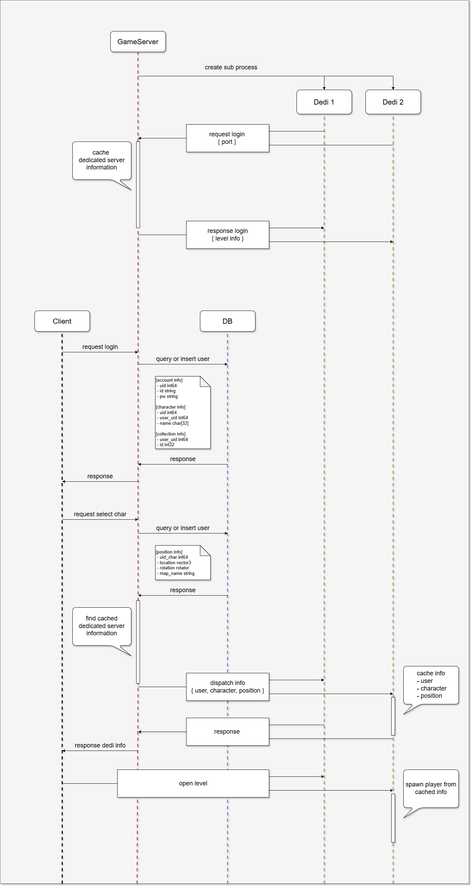

# Portfolio

    

## Career

### Mantisco (2020.01 ~ 2023.06)

#### 프로젝트: Carrieverse (2021.12 ~ 2023.06)

- 게임 서버 통신
- 서버 패킷 작성
- DB 수정
- 빌드 배포
- 빌드 자동화 및 Slack연동 (Jenkins)
- UI 기반 작업
- 리소스 관리
- 게임 컨텐츠 개발
  - 하우징

#### 프로젝트: Hunter's Arena (2020.01 ~ 2021.12)

- 게임 컨텐츠 개발
  - Steam, PS4, PS5 도전 과제
  - 키 가이드 
  - 전투 특성
  - 랭크

- 유지 보수 및 기타
  - 게임 매칭 시스템 리팩토링 및 구현
  - 프로필
  - 컬렉션

## Motivation

- 해당 포트폴리오는 Carrieverse 프로젝트를 진행하면서 다양한 업무들을 수행했던 경험을 되짚어보는 데 중점을 두고 있습니다. 그리고 서버 연동 작업과 Unreal Slate UI 개발을 통해 클라이언트-서버 통신과 UI 기술을 피력하고자 합니다.

## Platforms

  

- Windows 
- Ubuntu 
- Android 

## Development Environment

    

- Unreal Engine 5.4.2
- Visual Studio 2022
- Visual Studio Code
- MySQL Workbench 8.0 CE
- AWS

## Languages

- C/C++
- C# 

## Objectives

- 데디 서버와 게임 서버, 게임 서버와 클라이언트와 통신
  - 직렬화는 Google.Protobuf를 이용
  - 게임 서버와 데디 서버는 AWS의 EC2를 이용
  - DB는 AWS의 RDS를 이용

- 클라이언트는 서버와 통신을 수행하는 동작을 구현
  - 로그인 / 로그아웃
  - 컬렉션 수집
  - 데디 이동
  - 데이터 저장 (DB)
    - 계정 정보
    - 캐릭터 위치, 이름
    - 컬렉션

- Slate를 통한 UI 조작

## Game Play

## Game Flow Chart

## Server Arch

### Module

- **GameServer**
  - Logger
    - using Microsoft.Extensions.Logging
  - TCP Client
  - Protocol
  - Messages
  - Serialize / Deserialize
    - using Google.Protobuf
  - Interface
    - Responser
    - Handler
      - Notify Handler
      - Request Handler
  - Database
    - using MySql

- **Tool**
  - Publish
    - scp
    - ssh
  - Generator
    - CSharp
    - Unreal

## Unreal Project Arch

### Module

- **ZeeNet**
  - Private
    - Protocol
    - Messages
    - Serialize / Deserialize
      - using Google.Protobuf
    - Convert (Proto to Unreal)
  - Public 
    - Interface
      - Responser
      - Handler
        - Notify Handler
        - Request Handler
    - Unreal Messages
      - generated by Server.Generator
    - TCP Client

- **ZeeUI**
  - Public 
    - SlateStyles
    - Lobby
      - LoginWidget
      - CharacterSelectWidget
    - Common
      - Popup

- **ProjectPlayground**
  - ZeeUI, ZeeNet
  - Lobby
    - GameMode
    - PlayerController
    - Character
  - InGame
    - GameMode
    - PlayerController
    - Character
